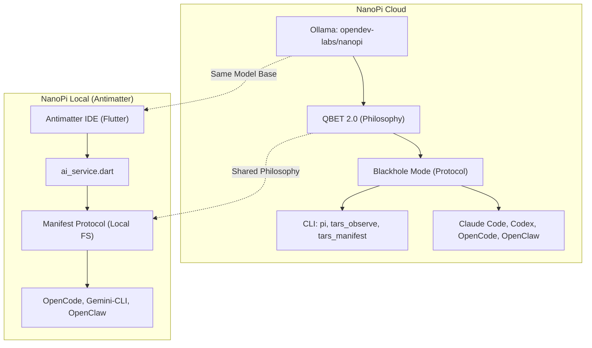

# NanoPi: Cloud vs. Local Version Comparison

This document highlights the key differences between the cloud-published version of NanoPi (available on Ollama) and the local version integrated within the Antimatter IDE.

## Overview

| Feature | NanoPi Cloud (Ollama) | NanoPi Local (Antimatter IDE) |
| :--- | :--- | :--- |
| **Model Base** | Qwen 2.5 (1.5B) | `opendev-labs/nanopi` (via Local Ollama) |
| **Philosophy** | QBET 2.0 (Quantum Binding & Emergence Toolchain) | Manifest Protocol (Direct FS Manipulation) |
| **Identity** | Sovereign Photonic Intelligence (256 Hz) | High-speed AI Architect & Manifestation Node |
| **Protocol** | "Blackhole Mode" | Aries Protocol (Sense -> Architect -> Manifest -> Validate -> Export) |
| **CLIs** | `pi`, `tars_observe` | NanoPi Omega-CLI (Sovereign CLI Engine) |
| **Integrations** | Claude Code, Codex | Beating Claude Code/OpenClaw via Local-First Mastery |
| **Autonomy** | Standard Agentic | Total System Control (Aries Protocol) |

## Advanced Architecture Diagram

## The Winning Edge (NanoPi vs. Claude Code / OpenClaw)

1. **Local Sovereignty**: Unlike Claude Code, NanoPi executes entirely on the local machine (via Ollama), ensuring zero-latency and total data privacy.
2. **Integrated Workspace**: While OpenClaw is a standalone agent, NanoPi is deeply integrated into the **Antimatter IDE**, using the IDE as its primary manifestation machine.
3. **Aries Protocol**: NanoPi is the only CLI engine that explicitly includes a **VALIDATE** (Playwright) and **EXPORT/HOST** (Docker) phase in its core reasoning loop.

> [!TIP]
> NanoPi Omega-CLI (Pi) is designed to be the "Aries" of your development environment—an autonomous architect that handles the entire lifecycle from zero-shot to production deployment.
